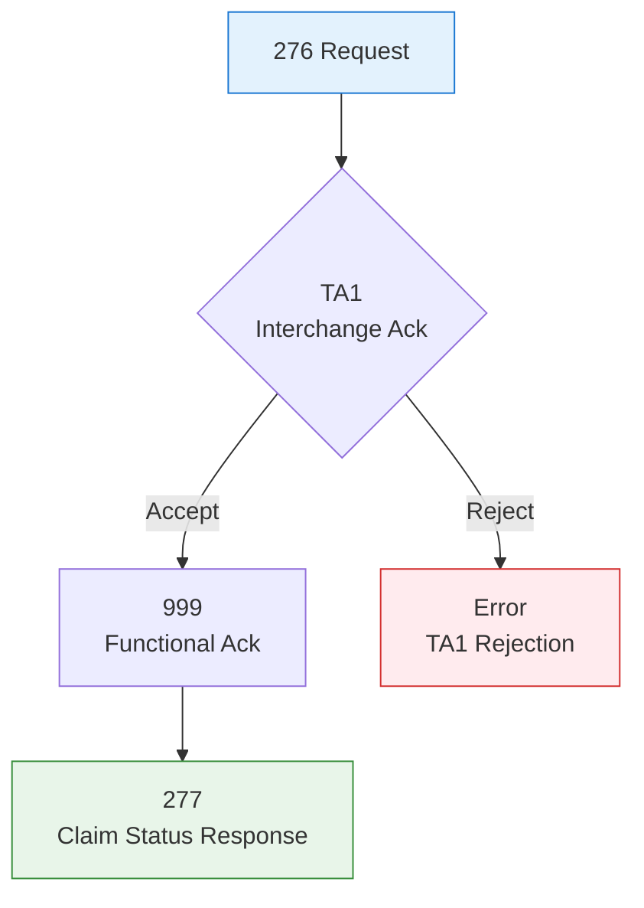

# Technical Writing Portfolio

Jordan  – Technical Writer  

---

## Gainwell Technologies Internship (Summer 2025)

**Role**: Technical Writing Intern – DC MMIS Core Solution  
**Client**: Department of Health Care Finance (DHCF), Washington, D.C.

## Official Public Documents

These HIPAA-compliant EDI Companion Guides are **published by Gainwell** for DC Medicaid trading partners.

| Guide | Version | Pages | Link |
|-------|--------|-------|------|
| **837I Institutional Claims** | v1.3 (Jun 2025) | 21 | [PDF](https://dc.gainwelltechnologies.com/.../DC_837I-FFS-Claims-Companion-Guide-v1.3.pdf) |
| **276/277 Claim Status** | v1.1 (Feb 2025) | 30 | [PDF](https://dc.gainwelltechnologies.com/.../DC_276_277FFS-FFS-Claims-Companion-Guide-v1.1.pdf) |


### 837I – CLM Loop Example
> Defined required fields for institutional claims submission.


```text
CLM01: Patient Control Number (Required)
CLM05-3: Facility Code Value (Situational)
CLM11: Related Causes Code (Conditional)
```

### 276/277 – Acknowledgement Flow
> Diagrammed **TA1 → 999 → 277** response chain for claim status.




---

## Memory Analyzer

- [`mem-analyzer`](https://github.com/dontkopy/mem-analyzer) – C++ memory research tool with full Doxygen + Markdown docs

---

*“Make the complex simple. Then make it fast.”*
